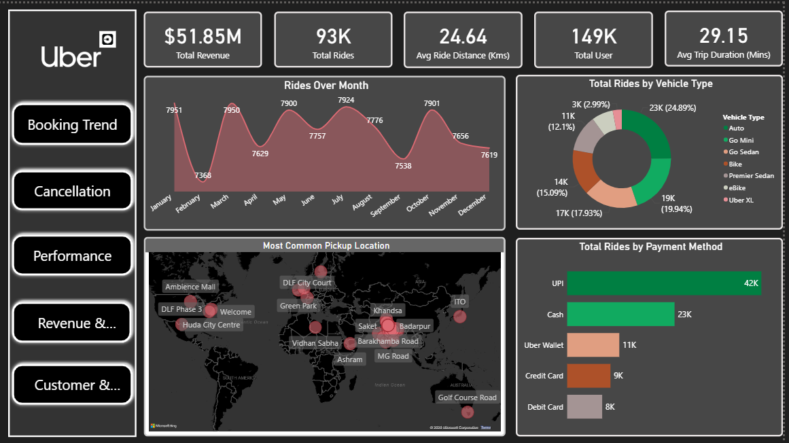
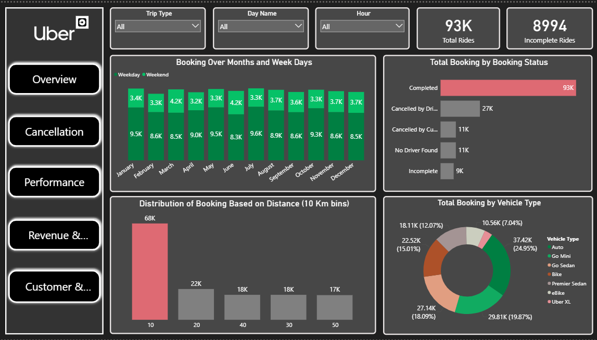
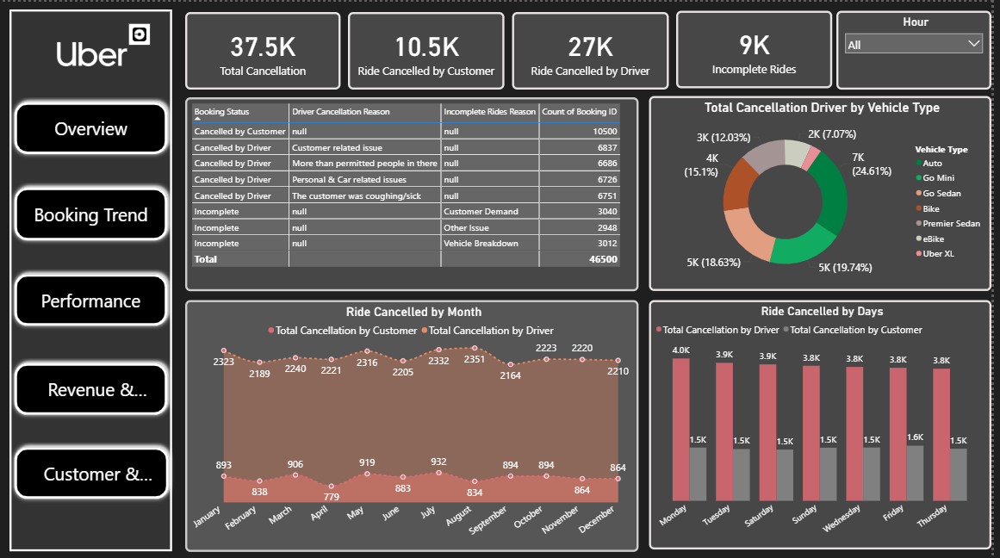
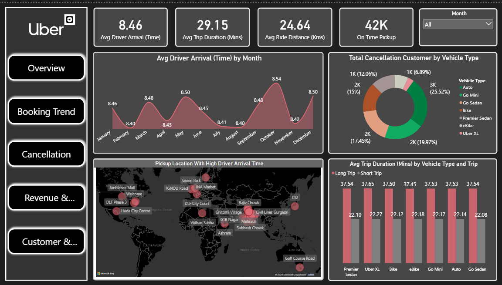
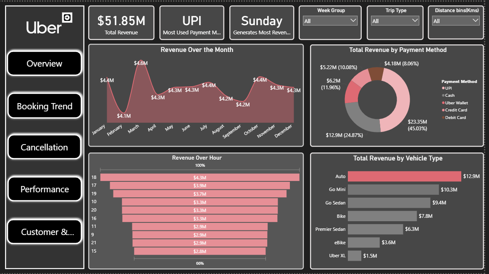

# 🚖 Uber Ride Analytics Dashboard (Power BI)

## 🧩 Business Problem Statement
Uber wants to gain a comprehensive understanding of ride demand, booking trends, cancellations, revenue performance, operational efficiency, and customer experience across its platform. The goal of this project is to analyze historical ride-level data to identify peak demand hours, revenue drivers, cancellation patterns, and operational bottlenecks in order to support data-driven decision-making for ride-hailing services.

## 🔍 Project Overview
To analyze Uber ride data using Power BI, perform data cleaning and transformation with Power Query, calculate key KPIs using DAX, and build an interactive dashboard that delivers actionable insights on ride demand, revenue, cancellations, driver and customer performance, and operational efficiency.

# 🧠 Executive Summary & Key KPIs

# Key KPIs
- **Total Revenue:** $51.85M  
- **Total Rides:** 93K  
- **Total Users:** 149K  
- **Average Ride Distance:** 24.64 Kms  
- **Average Trip Duration:** 29.15 mins  
- **On-Time Pickups:** 42K  
- **Total Cancellations:** 37.5K  

### Executive Insights
- Uber generated **$51.85M in revenue** from **93K rides**, indicating strong platform demand  
- Ride volume and revenue remain stable across most months with minor seasonal variations  
- **UPI** is the most used payment method, contributing ~45% of total revenue  
- **Auto and Go Mini** are the top-performing vehicle types by both rides and revenue  
- Evening commute hours and weekends show the highest ride demand  

---

## 📈 Booking & Ride Trend Analysis

### Insights
- Weekdays generate higher bookings compared to weekends  
- Monthly booking trends remain consistent with slight dips in select months  
- Majority of rides fall under **short-distance trips (≤10 km)**  
- Completed rides account for the largest share of total bookings  
- Auto, Go Mini, and Go Sedan dominate overall booking volume  

---

## ❌ Cancellation Analysis

### Insights
- **Total Cancellations:** 37.5K  
- **Driver Cancellations:** 27K  
- **Customer Cancellations:** 10.5K  
- Driver-side cancellations are significantly higher than customer cancellations  
- Key driver cancellation reasons include:
  - Customer-related issues  
  - Higher demand in nearby locations  
  - Personal or vehicle-related problems  
- Auto and Go Mini contribute the highest number of driver cancellations  
- Cancellation patterns remain relatively consistent across weekdays  

---

## ⚙️ Performance & Operations Analysis

### Insights
- **Average Driver Arrival Time:** 8.46 minutes  
- **Average Trip Duration:** 29.15 minutes  
- Certain pickup locations experience higher arrival times, indicating operational bottlenecks  
- Long trips average ~37 minutes across all vehicle types  
- Short trips average ~22 minutes, showing stable service performance  
- On-time pickups represent a strong portion of completed rides  

---

## 💰 Revenue Analysis

### Insights
- **Total Revenue:** $51.85M  
- **Sunday** generates the highest revenue among all days  
- **UPI** dominates revenue contribution, followed by Cash and Uber Wallet  
- Auto and Go Mini are the highest revenue-generating vehicle types  
- Peak revenue hours align with evening commute time (5 PM – 8 PM)  
- Monthly revenue remains stable with minor declines in late Q3  

---

## ⭐ Customer & Driver Rating Analysis

### Insights
- **Average Customer Rating:** 4.4 ⭐  
- **Average Driver Rating:** 4.2 ⭐  
- **44% of rides** receive ratings higher than 4.5  
- Majority of drivers fall within the **4.0–4.5 rating range**  
- Ratings remain consistent across all vehicle types  
- Low-rating areas highlight opportunities for service improvement  

---

## 🧰 Tools & Technologies Used

- **Power BI**
  - Power Query for data cleaning and transformation  
  - DAX for KPI calculations and measures  
  - Interactive slicers and drill-down dashboards
- **Data Visualization**
  - KPI Cards, Bar Charts, Line Charts, Donut Charts, Maps, Treemaps  

---

## 🔗 Conclusion

This Uber Ride Analytics project delivers actionable insights to:

- Analyze ride demand and booking behavior  
- Identify revenue drivers and peak operating hours  
- Understand cancellation patterns and operational challenges  
- Evaluate service performance and customer satisfaction  
- Support strategic decisions for fleet optimization and service improvements  

This project demonstrates strong **business analytics, data visualization, and Power BI expertise**, making it a **resume-ready portfolio project** for data analyst and business analyst roles.

